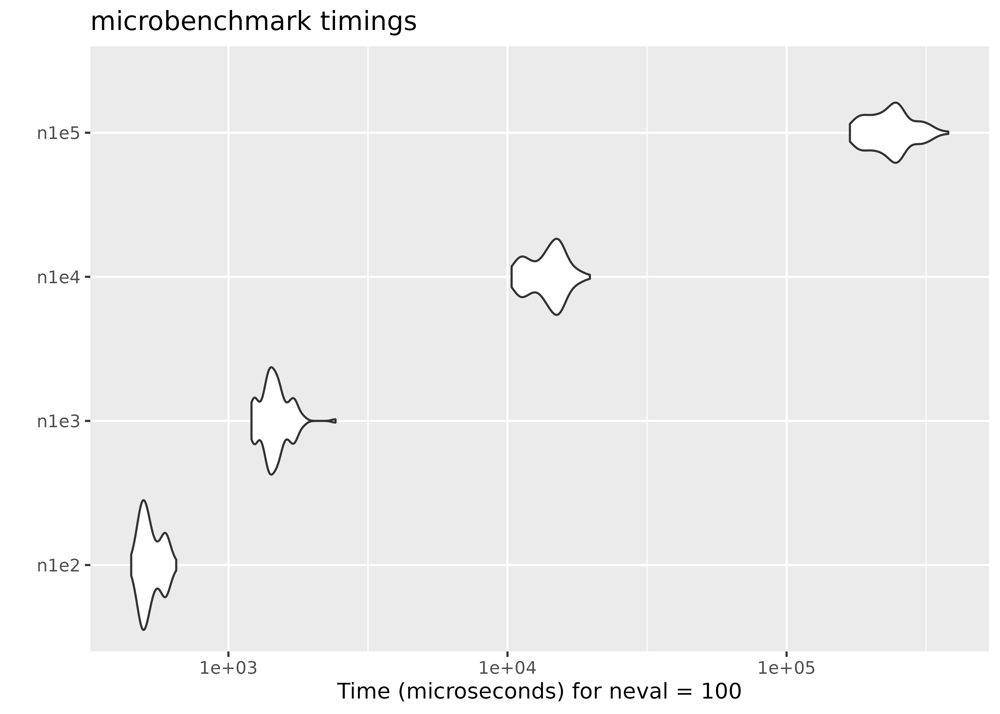
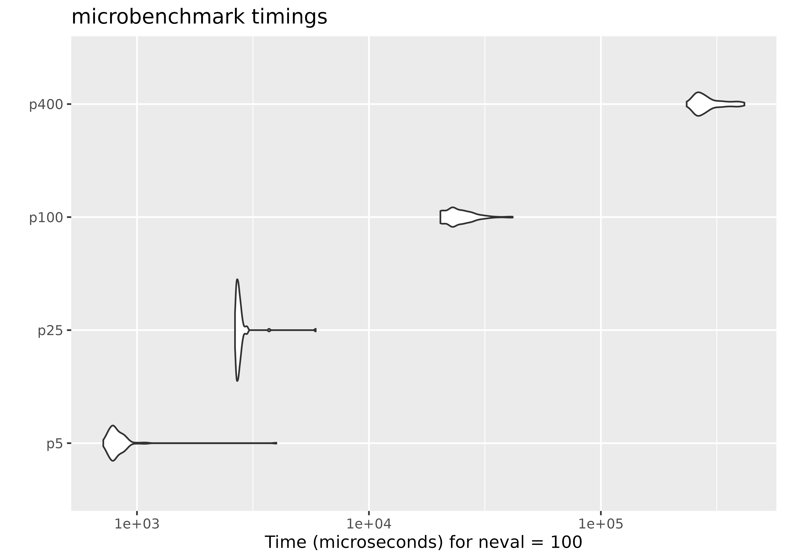

# Performance

All the tests were done on an Arch Linux x86_64 machine with an Intel(R)
Core(TM) i7 CPU (1.90GHz).

## Empirical likelihood computation

We show the performance of computing empirical likelihood with
[`el_mean()`](https://docs.ropensci.org/melt/reference/el_mean.md). We
test the computation speed with simulated data sets in two different
settings: 1) the number of observations increases with the number of
parameters fixed, and 2) the number of parameters increases with the
number of observations fixed.

## Increasing the number of observations

We fix the number of parameters at $`p = 10`$, and simulate the
parameter value and $`n \times p`$ matrices using
[`rnorm()`](https://rdrr.io/r/stats/Normal.html). In order to ensure
convergence with a large $`n`$, we set a large threshold value using
[`el_control()`](https://docs.ropensci.org/melt/reference/el_control.md).

``` r

library(ggplot2)
library(microbenchmark)
set.seed(3175775)
p <- 10
par <- rnorm(p, sd = 0.1)
ctrl <- el_control(th = 1e+10)
result <- microbenchmark(
  n1e2 = el_mean(matrix(rnorm(100 * p), ncol = p), par = par, control = ctrl),
  n1e3 = el_mean(matrix(rnorm(1000 * p), ncol = p), par = par, control = ctrl),
  n1e4 = el_mean(matrix(rnorm(10000 * p), ncol = p), par = par, control = ctrl),
  n1e5 = el_mean(matrix(rnorm(100000 * p), ncol = p), par = par, control = ctrl)
)
```

Below are the results:

``` r

result
#> Unit: microseconds
#>  expr        min         lq        mean     median         uq        max neval
#>  n1e2    448.417    488.080    527.1484    512.396    570.284    650.063   100
#>  n1e3   1209.666   1374.479   1477.1609   1452.485   1550.327   2419.623   100
#>  n1e4  10345.086  11966.901  13967.3879  14233.213  15275.122  19731.053   100
#>  n1e5 168587.766 203057.776 237929.4151 237147.607 254881.410 379573.806   100
#>  cld
#>  a  
#>  a  
#>   b 
#>    c
autoplot(result)
#> Warning: `aes_string()` was deprecated in ggplot2 3.0.0.
#> ℹ Please use tidy evaluation idioms with `aes()`.
#> ℹ See also `vignette("ggplot2-in-packages")` for more information.
#> ℹ The deprecated feature was likely used in the microbenchmark package.
#>   Please report the issue at
#>   <https://github.com/joshuaulrich/microbenchmark/issues/>.
#> This warning is displayed once per session.
#> Call `lifecycle::last_lifecycle_warnings()` to see where this warning was
#> generated.
```



## Increasing the number of parameters 

This time we fix the number of observations at $`n = 1000`$, and
evaluate empirical likelihood at zero vectors of different sizes.

``` r

n <- 1000
result2 <- microbenchmark(
  p5 = el_mean(matrix(rnorm(n * 5), ncol = 5),
    par = rep(0, 5),
    control = ctrl
  ),
  p25 = el_mean(matrix(rnorm(n * 25), ncol = 25),
    par = rep(0, 25),
    control = ctrl
  ),
  p100 = el_mean(matrix(rnorm(n * 100), ncol = 100),
    par = rep(0, 100),
    control = ctrl
  ),
  p400 = el_mean(matrix(rnorm(n * 400), ncol = 400),
    par = rep(0, 400),
    control = ctrl
  )
)
```

``` r

result2
#> Unit: microseconds
#>  expr        min         lq        mean     median          uq        max neval
#>    p5    715.755    771.444    848.0192    801.330    856.1025   3990.853   100
#>   p25   2646.376   2691.140   2788.7721   2734.485   2784.4635   5896.839   100
#>  p100  20329.920  22721.281  24724.3483  23203.450  26896.9045  41680.173   100
#>  p400 234344.999 258777.592 292136.9846 279937.230 314773.7035 415727.612   100
#>  cld
#>  a  
#>  a  
#>   b 
#>    c
autoplot(result2)
```



On average, evaluating empirical likelihood with a 100000×10 or 1000×400
matrix at a parameter value satisfying the convex hull constraint takes
less than a second.
