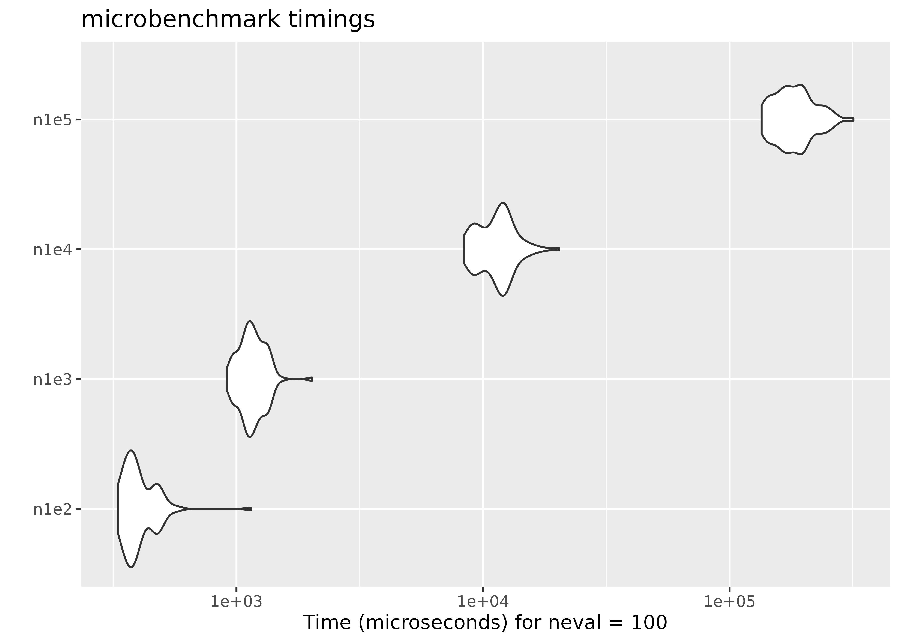
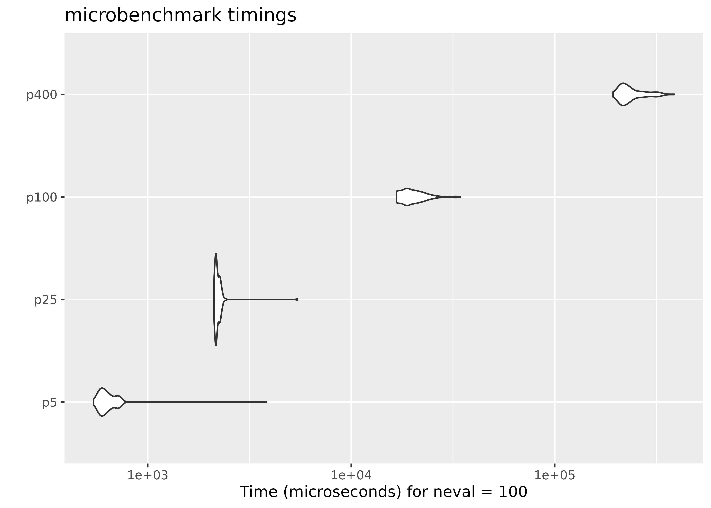

# Performance

All the tests were done on an Arch Linux x86_64 machine with an Intel(R)
Core(TM) i7 CPU (1.90GHz).

## Empirical likelihood computation

We show the performance of computing empirical likelihood with
[`el_mean()`](https://docs.ropensci.org/melt/reference/el_mean.md). We
test the computation speed with simulated data sets in two different
settings: 1) the number of observations increases with the number of
parameters fixed, and 2) the number of parameters increases with the
number of observations fixed.

## Increasing the number of observations

We fix the number of parameters at $`p = 10`$, and simulate the
parameter value and $`n \times p`$ matrices using
[`rnorm()`](https://rdrr.io/r/stats/Normal.html). In order to ensure
convergence with a large $`n`$, we set a large threshold value using
[`el_control()`](https://docs.ropensci.org/melt/reference/el_control.md).

``` r

library(ggplot2)
library(microbenchmark)
set.seed(3175775)
p <- 10
par <- rnorm(p, sd = 0.1)
ctrl <- el_control(th = 1e+10)
result <- microbenchmark(
  n1e2 = el_mean(matrix(rnorm(100 * p), ncol = p), par = par, control = ctrl),
  n1e3 = el_mean(matrix(rnorm(1000 * p), ncol = p), par = par, control = ctrl),
  n1e4 = el_mean(matrix(rnorm(10000 * p), ncol = p), par = par, control = ctrl),
  n1e5 = el_mean(matrix(rnorm(100000 * p), ncol = p), par = par, control = ctrl)
)
```

Below are the results:

``` r

result
#> Unit: microseconds
#>  expr        min         lq        mean      median         uq        max neval
#>  n1e2    330.870    361.971    408.5132    386.3825    460.262   1146.749   100
#>  n1e3    912.191   1073.450   1169.9851   1148.2515   1260.568   2026.142   100
#>  n1e4   8405.674   9728.995  11495.5061  11648.5035  12389.942  20373.105   100
#>  n1e5 134887.670 160522.940 185817.0503 179647.8260 199945.590 317923.044   100
#>  cld
#>  a  
#>  a  
#>   b 
#>    c
autoplot(result)
#> Warning: `aes_string()` was deprecated in ggplot2 3.0.0.
#> ℹ Please use tidy evaluation idioms with `aes()`.
#> ℹ See also `vignette("ggplot2-in-packages")` for more information.
#> ℹ The deprecated feature was likely used in the microbenchmark package.
#>   Please report the issue at
#>   <https://github.com/joshuaulrich/microbenchmark/issues/>.
#> This warning is displayed once per session.
#> Call `lifecycle::last_lifecycle_warnings()` to see where this warning was
#> generated.
```



## Increasing the number of parameters 

This time we fix the number of observations at $`n = 1000`$, and
evaluate empirical likelihood at zero vectors of different sizes.

``` r

n <- 1000
result2 <- microbenchmark(
  p5 = el_mean(matrix(rnorm(n * 5), ncol = 5),
    par = rep(0, 5),
    control = ctrl
  ),
  p25 = el_mean(matrix(rnorm(n * 25), ncol = 25),
    par = rep(0, 25),
    control = ctrl
  ),
  p100 = el_mean(matrix(rnorm(n * 100), ncol = 100),
    par = rep(0, 100),
    control = ctrl
  ),
  p400 = el_mean(matrix(rnorm(n * 400), ncol = 400),
    par = rep(0, 400),
    control = ctrl
  )
)
```

``` r

result2
#> Unit: microseconds
#>  expr        min          lq        mean      median          uq        max
#>    p5    541.552    589.0125    661.1195    616.1375    667.5145   3821.252
#>   p25   2116.777   2152.1690   2233.7512   2177.7910   2254.9155   5447.841
#>  p100  16688.425  18569.5425  20346.9503  18893.6080  22146.3320  34294.331
#>  p400 193523.905 212169.3800 240239.5869 229431.8910 258285.1350 386585.845
#>  neval cld
#>    100 a  
#>    100 a  
#>    100  b 
#>    100   c
autoplot(result2)
```



On average, evaluating empirical likelihood with a 100000×10 or 1000×400
matrix at a parameter value satisfying the convex hull constraint takes
less than a second.
